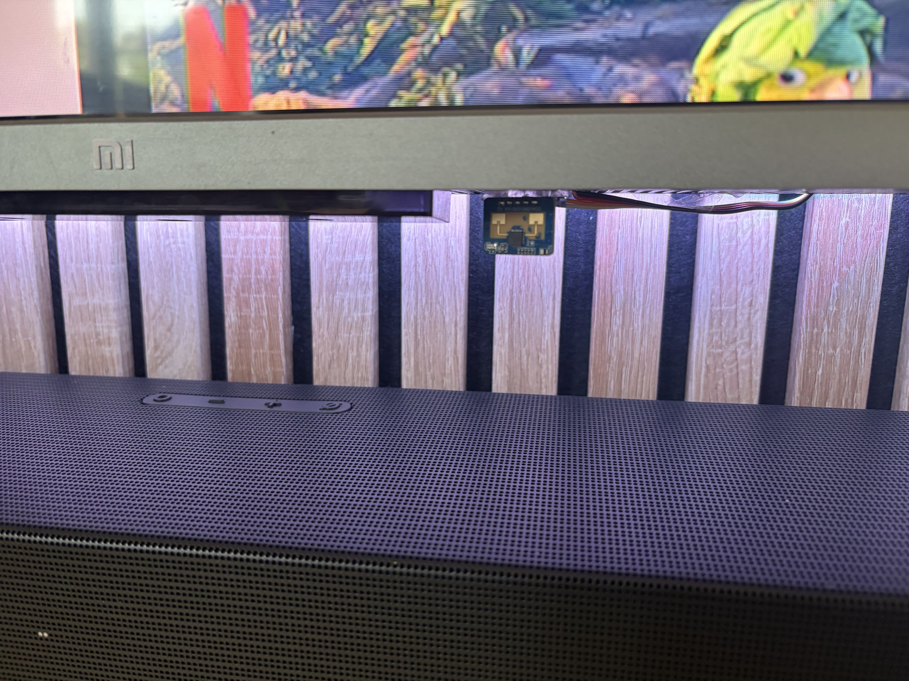
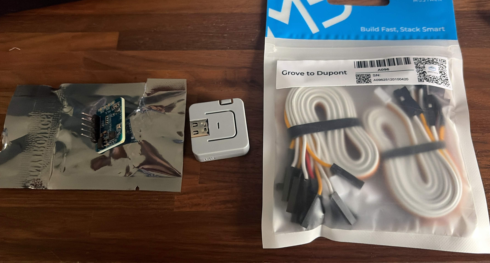

# TV Proximity Auto-Pause (mmWave Radar)

Dit project is een geautomatiseerde beveiligings- en comfortoplossing voor het homelab. Het pauzeert automatisch de televisie wanneer er iemand te dicht bij het scherm staat, en hervat de media zodra de persoon weer op gepaste afstand is. 

## De Use-Case (Waarom dit project?)
Met een opgroeiende peuter in huis die de neiging had om gefascineerd, veel te dicht voor de televisie te gaan staan, wilde ik een oplossing bouwen ter bescherming van haar ogen. 

Het doel was tweeledig:
1. **Oogbescherming:** Direct ingrijpen (media pauzeren) als de afstand tot het scherm te klein is (< 240cm).
2. **Gedragsverandering:** Door de directe visuele feedback (het stilvallen van het beeld) leert een kind razendsnel wat de grens is. 

**Resultaat:** Het project is een groot succes. Ze was direct gewend aan de nieuwe regel en blijft nu uit zichzelf op een veilige afstand staan, waardoor de flow in de praktijk nog maar zelden hoeft in te grijpen.

---

## Demo


---

## Hardware Stack
In plaats van een standaard PIR-sensor (die alleen grote bewegingen registreert en 'vergeet' dat iemand er staat als ze stilstaan), maakt dit project gebruik van actieve 24GHz mmWave radar voor millimeter-precieze aanwezigheidsdetectie.

* **Sensor:** Hi-Link HLK-LD2410C (24GHz Radar Module met Bluetooth)
* **Controller:** M5Stack Atom Lite (ESP32 Development Board)
* **Bekabeling:** M5Stack Grove naar Dupont (Male/Female, 20cm)
* **Voeding:** Standaard USB-C

### Fysieke Positionering & Kalibratie
Het correct plaatsen van een mmWave radar is cruciaal voor de betrouwbaarheid. 

1. **Materiaalinterferentie (Hout):** Initieel was de sensor esthetisch weggewerkt in het houten TV-meubel. De dichtheid van het hout zorgde echter voor verstrooiing van het radarsignaal, wat resulteerde in in accurate metingen. De sensor is nu direct **onder de rand van de televisie geplakt** voor een onbelemmerde *Line of Sight*.
2. **Field of View (FOV) Kalibratie:** De LD2410C heeft een zeer brede detectiehoek. Tijdens de eerste tests pikte de sensor ook beweging op van personen die verderop aan de eetkamerstoelen zaten. Door de sensor fysiek licht te kantelen en de detectiezones in ESPHome scherp af te stellen, is de actieve zone nu exclusief beperkt tot de directe kijkruimte voor de TV.

**Foto's van de opstelling:**



---

## Software & Architectuur

### 1. ESPHome (De Sensordata)
De M5Stack draait ESPHome en stuurt de radardata direct naar Home Assistant. 
Om te voorkomen dat de waarden te snel fluctueren (wat zou resulteren in een stotterend TV-beeld), is er op de microcontroller al een data-smoothing filter toegepast:

```yaml
filters:
  # Neemt het gemiddelde van de laatste 5 metingen voor een stabielere trigger
  - sliding_window_moving_average:
      window_size: 5
      send_every: 1

```

## 2. Node-RED (De Logica)
De ruwe afstand-triggers worden in Node-RED verwerkt. Hier zit een belangrijk stuk logica ingebouwd (de Smart Check):

Als er meerdere mensen tv kijken, en iemand loopt even door het beeld, moet de tv pauzeren. Echter, als de tv al handmatig door iemand op de bank was gepauzeerd, mag de flow de media niet automatisch hervatten zodra de persoon uit beeld loopt.

Dit is opgelost met een flow-variabele (auto_paused vlag):

Pauzeren: Alleen als de status 'playing' is, wordt er gepauzeerd en de vlag op true gezet.

Hervatten: Alleen als de vlag op true staat (en de persoon is > 260cm weg voor minimaal 4 seconden), wordt er weer op play gedrukt.

## 3. Integratie (Android TV)
De daadwerkelijke play/pause commando's worden afgevuurd via de androidtv integratie (remote.send_command met KEYCODE_MEDIA_PAUSE).

 Bekende Beperkingen (Known Issues)
Netflix API Restricties: De Android TV Remote integratie kan voor de meeste apps (zoals SmartTube, Delta TV) de huidige status (playing / paused) correct uitlezen. De officiële Netflix applicatie blokkeert deze status-updates echter actief. Binnen de Node-RED flow is daarom een expliciete uitzondering (bypass) geschreven die voorkomt dat de logica vastloopt wanneer Netflix geopend is.